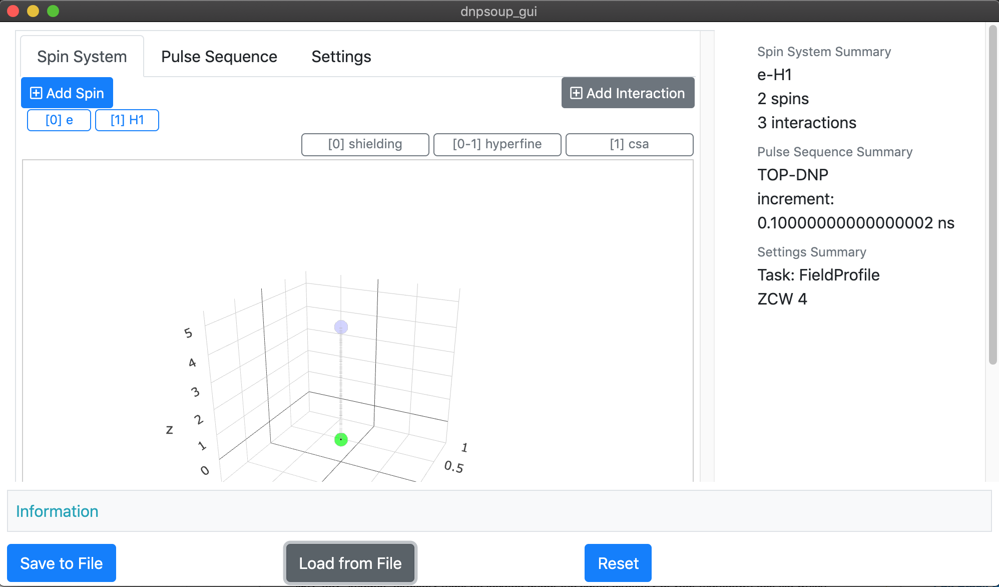
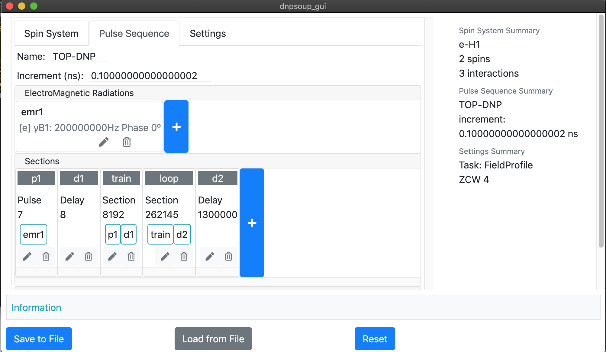
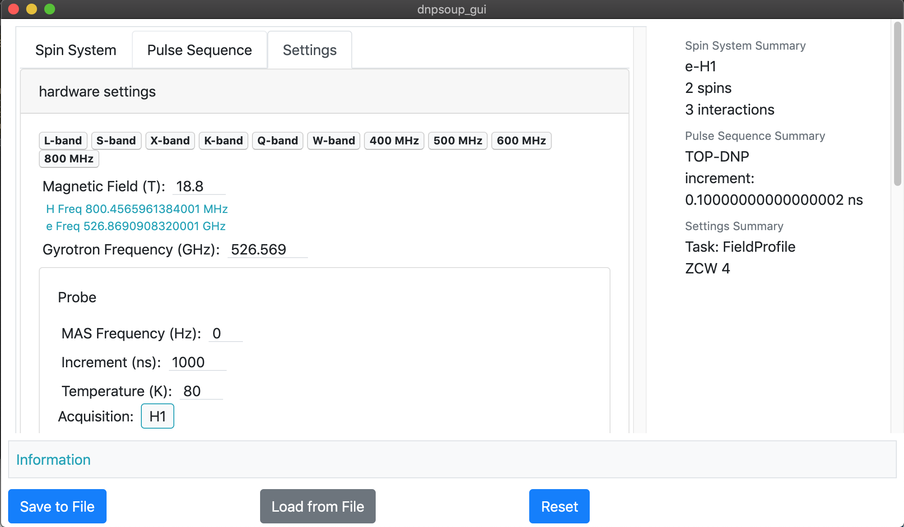

# dnpsoup_gui [In Development]

> A Graphic Interface for Preparing [DNP](https://en.wikipedia.org/wiki/Dynamic_nuclear_polarization) Simulation Inputs.

DNP Simulation inputs are separated into three categories:
  - Spin System
  - Pulse Sequence
  - Simulation Settings

The output of this software is a .json file. This file can serve as an input configuration for the command-line DNPSoup (In Development) Simulator.

#### Appearance






  
#### Download

``` bash
git clone https://github.com/cyang019/dnpsoup_gui.git
```


#### Run in Development Mode

Download [Node.js](https://nodejs.org/en/download/) for your platform.

```cd``` into the dnpsoup_gui root directory.

``` bash
# install dependencies
npm install

# run the software with development tools at localhost:9080
npm run dev
```


#### Build Setup

``` bash
# install dependencies
npm install

# serve with hot reload at localhost:9080
npm run dev

# build electron application for production
npm run build

# lint all JS/Vue component files in `src/`
npm run lint

```

---

This project was generated with [electron-vue](https://github.com/SimulatedGREG/electron-vue) using [vue-cli](https://github.com/vuejs/vue-cli). Documentation about the original structure can be found [here](https://simulatedgreg.gitbooks.io/electron-vue/content/index.html).
